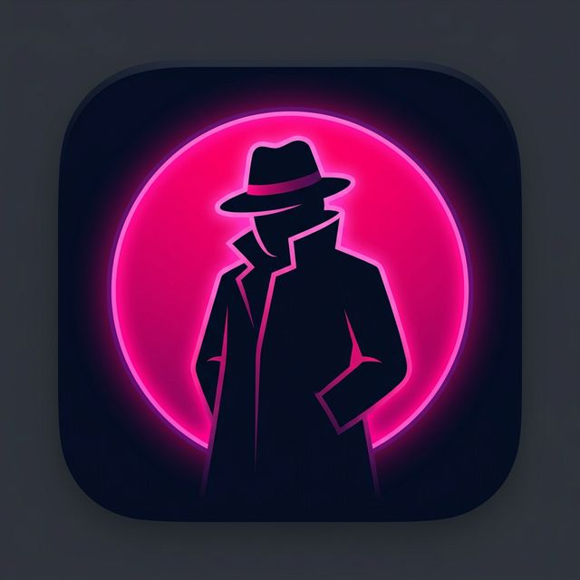

# 🕵️ Impostor — Social Game (Beta v1.1.0)

[](https://impostor-game.vercel.app/)
[](LICENSE)

**Impostor** is a fast-paced social deduction game designed to be played with friends, similar to *Undercover*. One player is secretly assigned as the **Impostor** while the rest are given a **Secret Word**. Players must describe their word without being too obvious, while the Impostor must blend in and guess the word.



---

## 🔥 Key Features

- **🔐 Privacy-First Security**: Roles and secret words are filtered on the server and sent individually to each player. No cheating via console!
- **⏱️ Global Timers**: Synchronized 2-minute talking phase and 1-minute voting phase managed by the server.
- **💬 Real-time Chat**: Integrated chat for discussing clues and voting (perfect for remote play without voice calls).
- **🎨 Glassmorphism UI**: Beautiful, modern interface with 3D card animations and neon accents.
- **📱 Mobile Responsive**: Play comfortably from any device or browse AZCA’s restaurants on the go.

---

## 🎮 How to Play

1. **Host a Game**: Create a room and share the 4-digit code with your friends.
2. **Join a Room**: Enter the room code and pick your alias.
3. **The Gameplay**: 
   - **Crew**: You see the same secret word. Describe it carefully.
   - **Impostor**: You see `???`. Listen to others, blend in, and survive.
4. **Voting**: Once the timer ends or everyone is ready, vote for who you think is the impostor. Your vote is final!

---

## 🛠️ Tech Stack

- **Frontend**: [React 19](https://react.dev/), [Vite](https://vitejs.dev/), [Socket.io-client](https://socket.io/), [Tailwind CSS / Custom CSS].
- **Backend**: [Node.js](https://nodejs.org/), [Express](https://expressjs.com/), [Socket.io](https://socket.io/).
- **Deployment**: [Vercel](https://vercel.com/) (Frontend), [Render](https://render.com/) (Backend).

---

## 📁 Project Structure

```text
├── backend/       # Socket.io Server & Game Logic (Node.js)
│   ├── gameManager.js  # Main Game State Management
│   └── index.js        # Server Entry Point
└── frontend/      # React Application (Vite)
    ├── src/            # Components, Hooks, & UI
    └── public/         # Icons & Assets (Favicon)
```

---

## 🚀 Getting Started

### Prerequisites
- [Node.js](https://nodejs.org/) installed on your machine.
- [Git](https://git-scm.com/) for version control.

### Installation

1. **Clone the repository**:
   ```bash
   git clone https://github.com/boorjanunezz/ImpostorGame.git
   cd ImpostorGame
   ```

2. **Run the Backend**:
   ```bash
   cd backend
   npm install
   npm run dev
   ```

3. **Run the Frontend**:
   ```bash
   cd ../frontend
   npm install
   npm run dev
   ```

---

## 📄 License

This project is licensed under the MIT License - see the [LICENSE](LICENSE) file for details.

*Developed with ❤️ by @boorjanunezz and Alejandro Benítez as a personal project to play with friends.*
